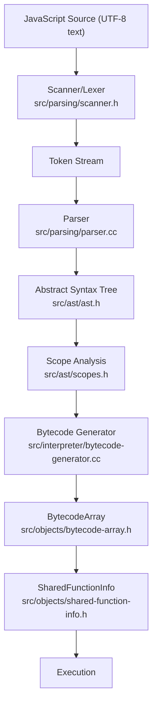
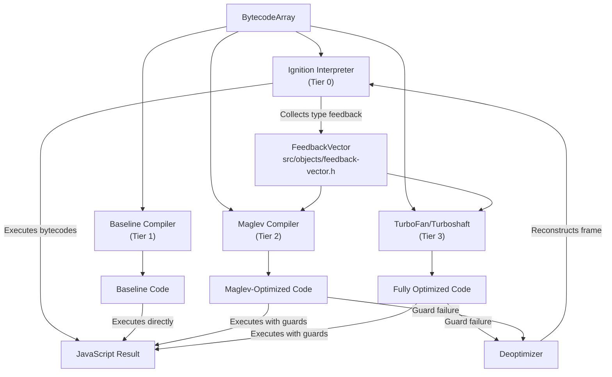
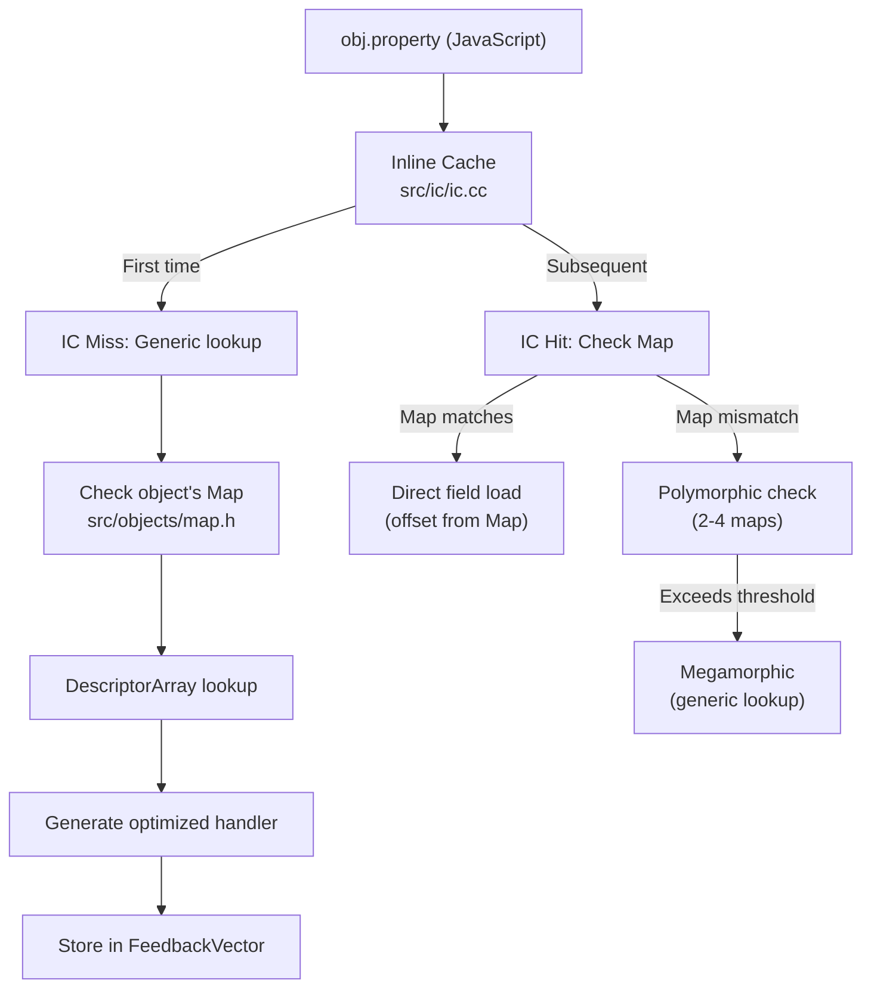
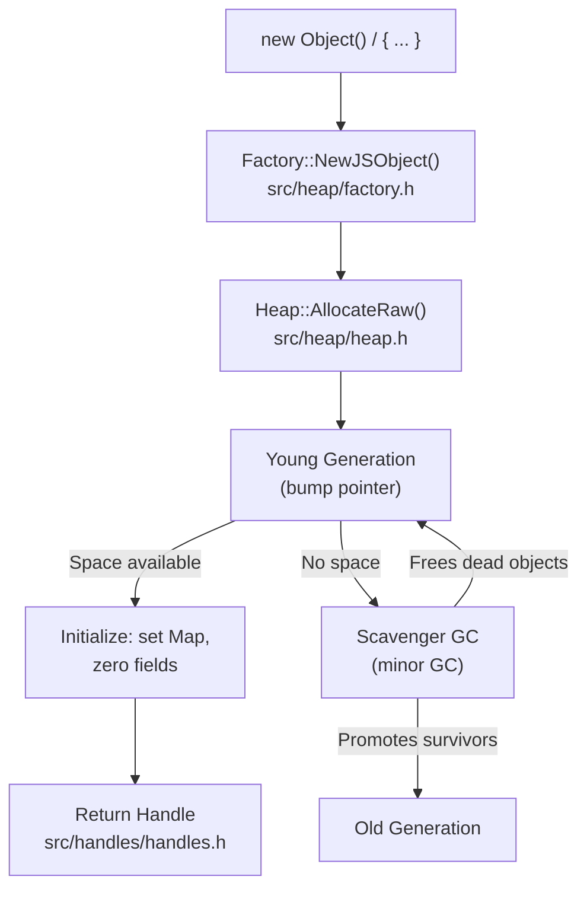
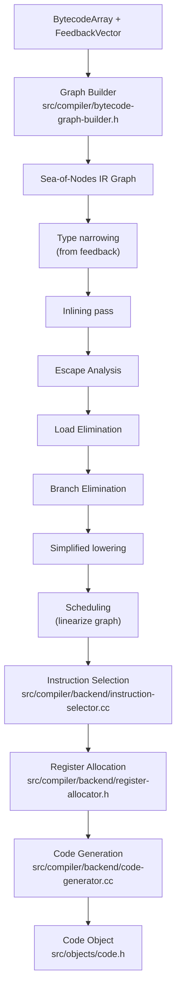
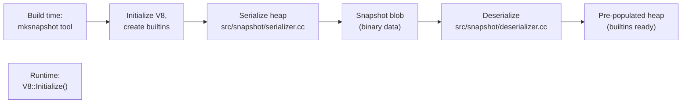

# V8 Data Flow

How data moves through V8 from source code to execution.

## 1. JavaScript Execution Pipeline



### Stage Details

**Source → Tokens (Scanner)**
- Input: UTF-8 or UTF-16 source text
- Output: Token stream (identifiers, keywords, literals, operators)
- Location: `src/parsing/scanner.h`
- The scanner handles Unicode, template literals, and automatic semicolon insertion.

**Tokens → AST (Parser)**
- Input: Token stream
- Output: Tree of AST nodes (`Expression`, `Statement`, `Declaration`)
- Location: `src/parsing/parser.cc`
- Recursive descent parser. Uses a **pre-parser** (`src/parsing/preparser.h`) for lazy parsing of function bodies not immediately needed.

**AST → Bytecode (Bytecode Generator)**
- Input: AST with scope information
- Output: `BytecodeArray` containing compact bytecode instructions
- Location: `src/interpreter/bytecode-generator.cc`
- Visits AST nodes and emits from V8's 244 bytecode instruction set.
- Also produces: constant pool, handler table (for try/catch), source position table.

## 2. Tiered Compilation Flow



### Tier Transitions

**Ignition → Baseline**: Triggered after a function is called a threshold number of times. Baseline compiles bytecode 1:1 to machine code without optimization.

**Ignition/Baseline → Maglev**: Triggered for "warm" functions. Uses feedback vector data to generate type-specialized code with guard checks.

**Any → TurboFan**: Triggered for "hot" functions or functions that would benefit from advanced optimizations (escape analysis, loop unrolling, inlining).

**Optimized → Ignition (Deoptimization)**: When a type guard fails (e.g., a property access assumed monomorphic receives an unexpected shape), the deoptimizer reconstructs the interpreter frame and resumes execution in Ignition.

## 3. Property Access Data Flow



### IC State Machine

```
UNINITIALIZED → MONOMORPHIC → POLYMORPHIC → MEGAMORPHIC
                     ↑                          |
                     └──── (reset on GC) ───────┘
```

- **Monomorphic**: Single Map → single handler. Fastest path.
- **Polymorphic**: Up to 4 Map/handler pairs checked linearly.
- **Megamorphic**: Generic hash-table-based lookup. Slowest.

## 4. Object Allocation Flow



### Write Barrier

When a pointer from an old-generation object is updated to point to a young-generation object, a **write barrier** records this in a **remembered set** so the Scavenger knows to scan those old-generation objects:

```
Store(old_obj.field = young_obj)
  → WriteBarrier::Marking(old_obj, field_offset, young_obj)
  → Record in remembered set / mark bitmap
```

## 5. Garbage Collection Data Flow

### Minor GC (Scavenger)

```
Young Generation (semi-space)
  ├── From-space (currently active)
  │   ├── Live objects → Copy to To-space (or promote to Old Gen)
  │   └── Dead objects → Reclaimed automatically
  └── To-space (becomes new From-space)

Roots scanned: stack, handles, global handles, remembered set entries
```

### Major GC (Mark-Compact)

```
Phase 1: Marking (concurrent + incremental)
  - Mark bitmap tracks reachable objects
  - Concurrent marking runs on background threads
  - Write barrier ensures new allocations are tracked

Phase 2: Sweeping (concurrent)
  - Free unmarked objects
  - Build free lists for each page
  - Background threads sweep pages concurrently

Phase 3: Compaction (if needed)
  - Move objects to reduce fragmentation
  - Update all pointers to moved objects
```

## 6. TurboFan Compilation Data Flow



### Sea-of-Nodes IR

TurboFan's IR is a **sea-of-nodes** graph where:
- **Value edges** represent data dependencies
- **Effect edges** chain side-effecting operations
- **Control edges** represent control flow

This SSA-based representation allows powerful optimizations like global value numbering, redundancy elimination, and dead code elimination without explicit scheduling.

## 7. Snapshot Serialization Flow



The snapshot avoids re-parsing and re-compiling the JavaScript standard library on every startup, reducing initialization time significantly.

## 8. WebAssembly Compilation Flow

```
WASM Binary (.wasm)
  → Decode module structure (src/wasm/module-decoder.cc)
  → Validate bytecode (src/wasm/function-body-decoder.h)
  → Liftoff baseline compilation (fast, per-function)
  → TurboFan optimizing compilation (background, hot functions)
  → Instantiate module with imports
  → Execute via compiled machine code
```

## 9. Embedder API Data Flow

```
Embedder C++ Application
  │
  ├── v8::V8::Initialize()          → Set up platform, load snapshot
  ├── v8::Isolate::New()            → Create execution context + heap
  ├── v8::Context::New(isolate)     → Create global scope
  ├── v8::String::NewFromUtf8()     → Create JS string from C++ string
  ├── v8::Script::Compile(ctx, src) → Parse + compile to bytecode
  ├── script->Run(ctx)              → Execute (triggers tiered compilation)
  ├── result->ToString()            → Convert JS value to C++ string
  └── isolate->Dispose()            → Tear down + free heap
```

Each value crossing the C++/JS boundary goes through **handles** (`v8::Local<T>`) that are tracked by `HandleScope` for garbage collection safety.
