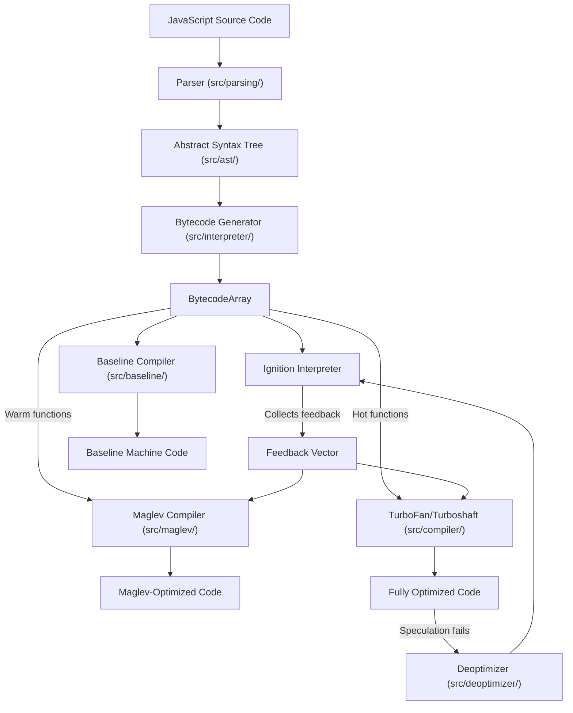

# V8 JavaScript Engine — Architecture Overview

## What V8 Is

V8 is Google's open-source, high-performance JavaScript and WebAssembly engine written in C++ (C++20 standard). It powers Google Chrome, Node.js, Deno, and can be embedded in any C++ application. The engine compiles and executes ECMAScript code, implements the WebAssembly specification, and provides a comprehensive embedding API.

## Core Architecture

V8 is organized as a **multi-tier compilation pipeline** with an adaptive optimization strategy. Code starts interpreted and is progressively compiled to more optimized machine code based on runtime profiling feedback.

### Compilation Tiers

| Tier | Name | Location | Strategy |
|------|------|----------|----------|
| 0 | Ignition | `src/interpreter/` | Bytecode interpreter; fast startup, collects type feedback |
| 1 | Baseline | `src/baseline/` | Non-optimizing JIT; quick compilation, no optimization passes |
| 2 | Maglev | `src/maglev/` | Mid-tier optimizer; fast compilation, good code quality |
| 3 | TurboFan | `src/compiler/` | Full optimizer; sea-of-nodes IR, advanced optimizations |

A newer backend called **Turboshaft** (`src/compiler/turboshaft/`) is replacing parts of TurboFan with a more maintainable graph IR.

## Key Subsystems

### 1. Parsing (`src/parsing/`, `src/ast/`)
Recursive-descent parser converts JavaScript source into ASTs. A **pre-parser** validates syntax without building full trees for lazily-compiled functions.

### 2. Object Model (`src/objects/`)
All JavaScript values are represented as **tagged pointers**:
- **Smi** (Small Integer): value encoded directly in the pointer (tag bit = 0)
- **HeapObject**: pointer to GC-managed object (tag bit = 1)

Objects use **hidden classes** (called **Maps** in V8) to track property layout. Maps form transition trees as properties are added, enabling fast property access through inline caches.

Key types: `JSObject`, `JSArray`, `JSFunction`, `Map`, `DescriptorArray`, `FeedbackVector`, `SharedFunctionInfo`, `Code`, `BytecodeArray`.

### 3. Heap & Garbage Collection (`src/heap/`)
Generational garbage collector with:
- **Young generation** (semi-space): fast allocation via bump pointer, collected by Scavenger (copying GC)
- **Old generation**: collected by Mark-Compact (mark-sweep with compaction)
- **Large object space**: objects exceeding page size
- **Code space**: executable pages for JIT-compiled code
- **Read-only space**: immutable root objects and builtins

GC features: incremental marking, concurrent marking, concurrent sweeping, write barriers for generational tracking.

### 4. Inline Caches (`src/ic/`)
Adaptive specialization for property access. Each property access site transitions through states:
- **Uninitialized** → **Monomorphic** (single shape) → **Polymorphic** (2-4 shapes) → **Megamorphic** (generic)

Feedback is stored in `FeedbackVector` objects and consumed by the optimizing compilers.

### 5. Runtime & Builtins (`src/runtime/`, `src/builtins/`)
JavaScript standard library implemented in three ways:
- **Torque** (`.tq` files): V8's domain-specific language, compiled to C++
- **C++**: direct runtime function implementations
- **Assembly**: architecture-specific hand-written stubs

### 6. WebAssembly (`src/wasm/`)
Full WebAssembly support with its own compilation pipeline (Liftoff baseline compiler + TurboFan optimizing compiler), module loading, instantiation, and JavaScript interop.

### 7. Debugging & Profiling (`src/debug/`, `src/inspector/`, `src/profiler/`)
Chrome DevTools Protocol implementation, breakpoints, stepping, CPU/heap profiling, and code coverage.

### 8. Snapshots (`src/snapshot/`)
Pre-serialized heap state for fast startup. Built-in functions and prototypes are compiled at build time and deserialized on engine startup rather than re-initialized from source.

## Memory Model

V8 uses **pointer compression** on 64-bit platforms: heap object pointers are stored as 32-bit offsets from an isolate-specific base address, halving pointer memory usage.

**Handles** (`src/handles/`) provide GC-safe references. `Handle<T>` is a scoped local reference; `Global<T>` persists across scopes. All object references from C++ code must go through handles to survive garbage collection.

**Zones** (`src/zone/`) are bump allocators for temporary compilation data. Each compilation phase allocates into a zone that is freed in bulk when the phase completes.

## Concurrency Model

V8 is fundamentally **single-threaded per Isolate** for JavaScript execution. However, background threads handle:
- Concurrent compilation (Maglev, TurboFan)
- Concurrent GC marking and sweeping
- Concurrent parsing (for streaming compilation)

The **Isolate** (`src/execution/isolate.h`) is the central execution context. Each isolate has its own heap, compilation state, and execution stack. Multiple isolates can run in parallel on different threads.

## Platform & Architecture Support

- **Architectures**: x64, ARM64, ARM, IA-32, MIPS64, RISC-V, LoongArch, PPC64, S390x
- **Operating Systems**: Linux, Windows, macOS, Android, iOS, Fuchsia
- **Build Systems**: GN (primary, generates Ninja), Bazel (secondary)

## Entry Points

| Purpose | Entry Point | File |
|---------|-------------|------|
| Embedding API | `v8::Isolate::New()`, `v8::Context::New()` | `include/v8-isolate.h`, `include/v8-context.h` |
| Script execution | `v8::Script::Compile()`, `script->Run()` | `include/v8-script.h` |
| Standalone shell | `main()` in d8 | `src/d8/d8.cc` |
| Engine init | `v8::V8::Initialize()` | `include/v8-initialization.h` |
| Bootstrap | `Bootstrapper::InstallNatives()` | `src/init/bootstrapper.cc` |

## Key File References

| Area | Most Important File | Why |
|------|-------------------|-----|
| Public API | `include/v8.h` | Includes all public headers |
| Isolate | `src/execution/isolate.h` | Central execution context |
| Object base | `src/objects/heap-object.h` | Foundation of object model |
| Hidden classes | `src/objects/map.h` | Property layout tracking |
| Heap | `src/heap/heap.h` | Memory management core |
| Bytecodes | `src/interpreter/bytecodes.h` | All 244 bytecode definitions |
| Compiler IR | `src/compiler/node.h` | Sea-of-nodes graph nodes |
| Builtins | `src/builtins/builtins-definitions.h` | All builtin registrations |
| Globals | `src/common/globals.h` | Constants, types, architecture defs |

## Project Scale

| Metric | Value |
|--------|-------|
| C++ source lines | ~684,000 |
| Source subdirectories | 46 |
| Public API headers | 60+ |
| Torque builtin files | 244 |
| Bytecode types | 244 |
| Test directories | 26 |
| Supported architectures | 9 |
| Contributors | Thousands (see AUTHORS file) |
